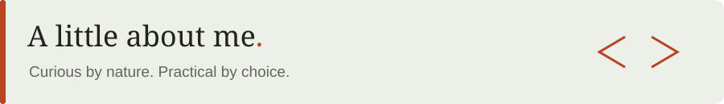

  

<h3 align="center">Software Engineer | Applied AI</h3>

I’m <strong>Saad</strong>. I build business software, student tools, and AI systems shaped around real constraints.

Based in Lahore, Pakistan. Available remotely.

  
  

<h2>Selected work</h2>

<table>
<tr>
<th width="33%">Mill Ledger</th>
<th width="33%">UCP Noticeboard</th>
<th width="33%">Opportunity Inbox Copilot</th>
</tr>
<tr>
<td valign="top">
<em>Offline-first business software</em>

A bilingual desktop ledger for Abdullah Rice Mill: payment evidence, receipts, reports, and recovery backups.
</td>
<td valign="top">
<em>Student information system</em>

University announcements brought together through a browser extension and installable PWA.
</td>
<td valign="top">
<em>Applied AI &amp; discovery</em>

Finds opportunities in Gmail, ranks them against user profiles, and helps people act before deadlines.
</td>
</tr>
<tr>
<td>Electron Node.js PostgreSQL</td>
<td>Browser extension PWA Full-stack</td>
<td>MERN GPT-4o-mini Gmail API</td>
</tr>
<tr>
<td align="center"></td>
<td align="center"></td>
<td align="center"></td>
</tr>
</table>

Pre-med turned computer scientist. Drawn to the work of making things work.

I start with the business constraint, compare the tradeoffs, and build a practical path to delivery. My work spans full-stack development, applied AI, automation, and teaching.

<strong>BS Computer Science</strong> 
University of Central Punjab · 2023–2027 
3.92 / 4.00 CGPA · 100% merit scholarship

<strong>Marketing Director</strong> 
Hult Prize · UCP On-Campus

<strong>Hackathon Director</strong> 
IEEE Computer Society · UCP Student Chapter

  
  

<h2>Tools I build with</h2>

  
  
  
  
  
  
  
  
  
  
  
  
  
  
  
  

<strong>Full-stack:</strong> React, Node.js, FastAPI, PostgreSQL, MongoDB 
<strong>Applied AI:</strong> LLMs, agents, n8n 
<strong>Delivery:</strong> Docker, Git, Electron, PWAs

<h3 align="center">Good work starts with a conversation.</h3>

Have a role, a product idea, or a problem worth solving?

  
  

Lahore, Pakistan · Working worldwide

