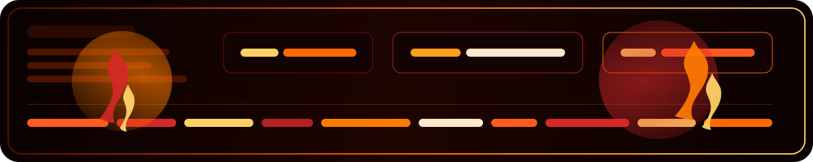

<div align="center">


[](https://git.io/typing-svg)




</div>

<h1 align="center">I do not build boring things.</h1>

<p align="center">
  
  
  
  
</p>

<p align="center">
  I am <b>Saad Nazir</b> - an AI automation hacker, full-stack builder, and high-agency problem solver.
  <br />
  I like turning rough ideas into sharp systems, shipping products with heat, and building tech that actually does something in the real world.
</p>

---

## Burn Profile

```text
Name        : Saad Nazir
Role        : AI / Automation Hacker + Full-Stack Builder
Operating   : Fast, focused, curious, and slightly dangerous to boring ideas
Mission     : Build useful systems with brains, speed, and presence
Vibe        : Polymath energy. Hacker execution. Product instinct.
```

---

## What I Bring To The Fire

- I build AI-powered workflows, bots, and assistant systems that solve practical problems.
- I work across backend, frontend, product logic, and automation without waiting around.
- I enjoy projects that mix intelligence, user experience, and real operational value.
- I prefer momentum over noise, clarity over fluff, and execution over empty talk.

---

## Arsenal

<p align="center">
  
</p>

<p align="center">
  
  
  
</p>

---

## Featured Builds

### Medical Triage System
[](https://github.com/saad-nazir-0289/Medical-Triage-System)

An AI-driven medical pre-interview system built to assess urgency using WHO-aligned logic and guide users toward smarter next actions.

### FAQ Chatbot
[](https://github.com/saad-nazir-0289/Faq-chatbot)

A FastAPI chatbot system with lead capture, consultation flow, admin tooling, and exports - designed to be useful, structured, and deployable.

### Lead Qualification And Auto Reply Workflow
[](https://github.com/saad-nazir-0289/lead-qaulification-and-auto-reply-workflow)

An AI-powered workflow connecting n8n, Gmail, Sheets, and LLM logic to qualify leads and trigger instant, contextual responses.

### Taakra Portal
[](https://github.com/saad-nazir-0289/Taakra-Portal)

A full-stack competition platform for creators - built around discovery, registration, deadlines, support, and a strong product feel.

### Opinboxpilot
[](https://github.com/saad-nazir-0289/opinboxpilot)

A recent build in the mix that reflects my bias toward shipping practical tools instead of collecting unfinished ideas.

---

## Live Metrics From The Heat Zone

<p align="center">
  
  
  
</p>

<div align="center">
  
</div>

<div align="center">
  
</div>

---

## Current Signal

- Building AI-assisted tools that do more than just look impressive in a demo.
- Exploring stronger workflow automation, product systems, and deployment-ready backend logic.
- Pushing toward projects that feel fast, intelligent, and useful under real constraints.

---

## Connect With Me

<p align="center">
  <a href="https://www.linkedin.com/in/saad-nazir0289">
    
  </a>
  <a href="https://www.instagram.com/_saad_nazir_">
    
  </a>
</p>

---

<div align="center">

### Fuel. Focus. Fire.


</div>
