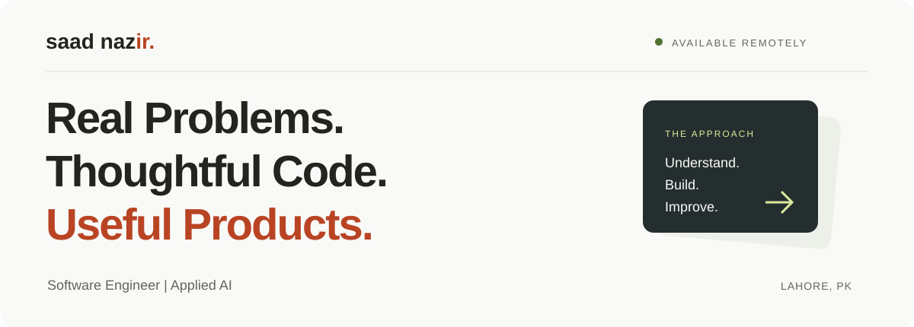
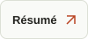
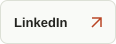

  

   &nbsp; · &nbsp;
   &nbsp; · &nbsp;
   &nbsp; · &nbsp;
  

I’m **Saad**, a software engineer working across full-stack development, applied AI, and automation. I turn business constraints into working software—from offline tools to intelligent systems.

The problem comes first. The stack follows.

---

### 01 / Selected work

| Project | Built for a reason |
| :--- | :--- |
|  | A bilingual, offline-first desktop ledger for Abdullah Rice Mill. Payment evidence, receipts, reporting, and recovery backups. **Electron · Node.js · PostgreSQL** |
|  | Scattered university announcements brought together through a browser extension and installable PWA. **Browser extension · PWA · Full-stack** |
|  | A multi-agent system that finds opportunities in Gmail, ranks them against user profiles, and helps people act before deadlines. **MERN · GPT-4o-mini · Gmail API** |

### 02 / A little about me

Pre-med turned computer scientist. Drawn to the work of making things work.

- **Product thinking:** understand the constraint, compare tradeoffs, and build around real workflows.
- **Full-stack development:** web platforms, APIs, and desktop software.
- **Applied AI:** agents, intelligent search, and automation where they solve a useful problem.
- **Teaching:** competitive programming instruction and helping students build a foundation.

### 03 / My toolbox

  

**Also working with:** LLMs · AI agents · n8n · Electron · PWAs

### 04 / Beyond the projects

**BS Computer Science · University of Central Punjab**  
2023–2027 · 3.92 / 4.00 CGPA · 100% merit scholarship

**Marketing Director · Hult Prize, UCP On-Campus**  
**Hackathon Director · IEEE Computer Society, UCP Student Chapter**

Hackathons, business cases, teaching, and a funded research proposal have shaped how I approach the work.

 &nbsp; · &nbsp; 

---

<b>Good work starts with a conversation.</b>

  Lahore, Pakistan · Working worldwide  
   &nbsp; · &nbsp;
   &nbsp; · &nbsp;
  

