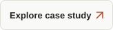

  

<h3 align="center">Software Engineer | Applied AI</h3>

I’m <strong>Saad</strong>. I build business software, student tools, and AI systems shaped around real constraints.

Based in Lahore, Pakistan. Available remotely.

  
  

<h3 align="center">01 — Built for a reason</h3>

<h4 align="center">Mill Ledger</h4>

<em>Business software / Offline-first</em>

A bilingual desktop ledger for Abdullah Rice Mill. Payment evidence, receipts, reporting, and recovery backups—built around everyday operations.

<strong>Electron · Node.js · PostgreSQL</strong>

<h4 align="center">UCP Noticeboard</h4>

<em>Student tools / Information access</em>

University announcements, brought together. A browser extension and installable PWA that help students find what matters.

<strong>Browser extension · PWA · Full-stack</strong>

<h4 align="center">Opportunity Inbox Copilot</h4>

<em>Applied AI / Opportunity discovery</em>

A multi-agent system that finds opportunities in Gmail, ranks them against user profiles, and helps people act before deadlines.

<strong>MERN · GPT-4o-mini · Gmail API</strong>

  

  

<h3 align="center">02 — The bigger picture</h3>

Pre-med turned computer scientist. Drawn to the work of making things work.

I start with the business constraint, compare the tradeoffs, and build a practical path to delivery. My work spans full-stack development, applied AI, automation, and teaching.

<strong>BS Computer Science</strong> 
University of Central Punjab · 2023–2027 
3.92 / 4.00 CGPA · 100% merit scholarship

<strong>Marketing Director</strong> 
Hult Prize · UCP On-Campus

<strong>Hackathon Director</strong> 
IEEE Computer Society · UCP Student Chapter

  
  

<h3 align="center">03 — My toolbox</h3>

  

<strong>Full-stack:</strong> React, Node.js, FastAPI, PostgreSQL, MongoDB 
<strong>Applied AI:</strong> LLMs, agents, n8n 
<strong>Delivery:</strong> Docker, Git, Electron, PWAs

<h3 align="center">Good work starts with a conversation.</h3>

Have a role, a product idea, or a problem worth solving?

  
  

Lahore, Pakistan · Working worldwide

