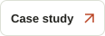

  

<h3 align="center">Software Engineer · Full-Stack · Applied AI</h3>

<strong>I build software that gets used.</strong> From offline business systems and campus products to computer vision and remote-sensing research.

BS Computer Science @ UCP · 3.93/4.00 CGPA · Lahore, Pakistan · Open to software engineering opportunities

  
  

<h2>What I've shipped</h2>

<table>
<tr><th width="50%">Mill Ledger</th><th width="50%">UCP Noticeboard</th></tr>
<tr>
<td valign="top"><strong>Client software · In production</strong>  Offline-first, bilingual desktop software built for a rice mill to manage transactions, ledgers, receipts, verification evidence, aging, audit trails, and backups.</td>
<td valign="top"><strong>Public product · Live</strong>  A Chrome extension + installable PWA that puts campus notices where UCP students already look, backed by a shared publishing system.</td>
</tr>
<tr><td><strong>Built with:</strong> Electron · React · TypeScript · SQLite</td><td><strong>Built with:</strong> React · TypeScript · ASP.NET Core · PostgreSQL</td></tr>
<tr>
<td align="center"></td>
<td align="center"></td>
</tr>
</table>

<h3>Currently building & researching</h3>

- **UCP Gate Vision** — leading development of a campus ANPR system for real-time vehicle/plate detection, tracking, recognition, and gate events.
- **AgriVision** — final-year research on spatiotemporal fusion of MODIS + Sentinel-2 imagery toward daily 10 m NDVI.
- **Applied AI & automation** — building practical workflows, search systems, and agents around real operational problems.

<table>
<tr>
<td align="center"><strong>10+</strong> competition wins</td>
<td align="center"><strong>3.93/4.00</strong> CGPA</td>
<td align="center"><strong>40+</strong> students mentored</td>
<td align="center"><strong>PKR 1M</strong> funded research proposal · co-author</td>
</tr>
</table>

I’m a final-year Computer Science student who likes taking ambiguous problems and turning them into working systems. My work spans full-stack products, desktop software, applied AI, computer vision, automation, and research. I’ve also taught competitive programming, worked as an OOP lab TA, led technical teams, and competed across hackathons and business competitions.

  
  
  

<h2 align="center">Tools I build with</h2>

  
  
  
  
  
  
  
  
  
  
  
  
  
  
  
  

<strong>Full-stack:</strong> React, Node.js, FastAPI, PostgreSQL, MongoDB 
<strong>Applied AI:</strong> LLMs, agents, n8n 
<strong>Delivery:</strong> Docker, Git, Electron, PWAs

<h3 align="center">Have a role, product, or hard problem worth solving?</h3>

I’m interested in software engineering, full-stack, and applied-AI work where I can ship real systems.

  
  

Lahore, Pakistan · Working worldwide

